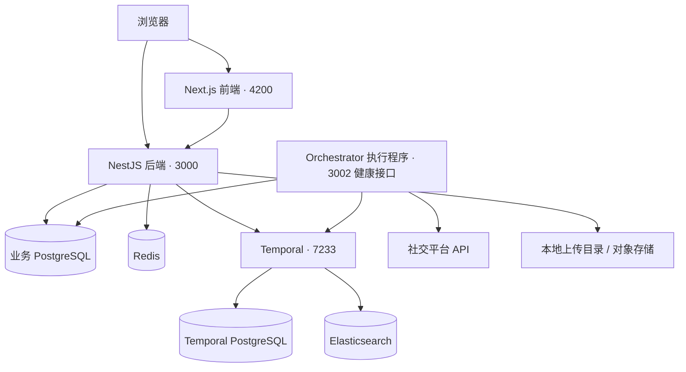

# Postiz 项目理解指南

> 启动流程更新（2026-09-28）：根目录 `pnpm run dev` 使用 `scripts/dev.mjs` 管理开发进程，依次等待后端、Orchestrator、前端和扩展就绪。启动前检查端口冲突；每个服务最多等待 240 秒；退出或启动失败时清理本次启动的子进程。使用 Ctrl+C 正常停止，避免直接强制关闭终端。当前不提供 `dev:stop` / `dev:restart` 命令。

本文面向第一次阅读这个仓库的人，按“产品做什么 → 页面在哪里 → 请求怎么执行 → 如何启动和排错”介绍项目。

依据：当前仓库代码及本地开发配置，整理于 2026-09-27。端口以默认配置为准；文中的服务清单不代表它们此刻一定运行。本文不包含 `.env` 中的密码、Token 或平台密钥。

## 1. 这个项目做什么

Postiz 是一个社交媒体内容管理和定时发布平台。用户可以连接社交账号、管理图片和视频、编辑帖子、安排发布时间，并查看发布状态和分析数据。仓库还包含 AI 助手、第三方服务接入、组织权限和订阅计费等模块；具体功能能否使用取决于环境变量、平台授权和外部服务配置。

最典型的使用路径是：

> 登录 → 连接社交账号 → 上传素材 → 编辑帖子 → 保存草稿或安排发布 → 后台执行 → 查看结果。

它是一个 pnpm workspace 单仓库项目：多个应用共享依赖和业务代码。代码里的 `gitroom`、`@gitroom/...` 是现有包名和路径别名，不代表另一个必须安装的服务。

## 2. 整体架构



Orchestrator 主动从 Temporal 获取任务。图中连接表示调用或依赖关系，不表示所有业务都严格依次经过每个组件。

| 组件 | 负责什么 | 缺少它时的表现 |
| --- | --- | --- |
| Frontend | 页面、编辑器、交互和展示 | 无法打开应用界面 |
| Backend | 登录、权限、帖子、账号、素材等 HTTP API | 页面请求失败，无法完成业务操作 |
| 业务 PostgreSQL | 保存用户、组织、帖子、账号连接和素材记录 | 后端数据库操作失败 |
| Redis | 缓存及限流等共享状态；后端全局限流使用 Redis | 相关初始化或请求处理可能失败 |
| Temporal | 持久化工作流状态，协调等待、任务分发和恢复 | 当前后端初始化依赖它，连接失败会阻止启动 |
| Orchestrator | 运行工作流和 Activity，执行发布、媒体处理等任务 | API 可能可用，但后台任务无人执行 |
| Temporal PostgreSQL | 保存 Temporal 的工作流历史和内部数据 | Temporal 无法正常工作 |
| Elasticsearch | 当前 Compose 中用于 Temporal 的工作流检索 | Temporal 初始化或检索功能受影响 |

**两个 PostgreSQL 用途不同。** `postiz-postgres` 保存 Postiz 业务数据，`temporal-postgresql` 保存任务系统的数据。

**Temporal 与 Orchestrator 也不同。** Temporal 保存和协调任务；真正调用社交平台、执行具体业务的代码运行在 Orchestrator 中。关闭网页不会取消已保存的定时任务，但任务要按时执行，相关后台服务必须运行。

## 3. 目录地图

| 路径 | 内容 | 什么时候看 |
| --- | --- | --- |
| `apps/frontend` | Next.js / React 前端 | 改页面、菜单、编辑器、交互 |
| `apps/backend` | NestJS HTTP API | 改接口、认证、权限和请求处理 |
| `apps/orchestrator` | Temporal Worker、工作流、Activity | 改发布流程、重试、后台任务 |
| `apps/extension` | 浏览器扩展，辅助基于 Cookie 的平台认证 | 修改扩展行为或平台连接方式 |
| `apps/sdk` | 对外的 Node SDK，包名 `@postiz/node` | 理解外部程序如何调用 Postiz |
| `apps/commands` | 命令行任务入口 | 查看仓库提供的管理命令 |
| `libraries/nestjs-libraries` | 共享业务服务、数据库访问、平台集成、上传、AI、Temporal 配置 | 后端和 Worker 共用的大部分逻辑 |
| `libraries/react-shared-libraries` | React 共用代码及国际化等 | 修改共享前端能力 |
| `libraries/helpers` | 通用工具、配置检查和请求辅助代码 | 查找跨应用工具 |
| `dynamicconfig` | Temporal 动态配置 | 查看任务服务的配置 |
| `var` | Docker 等部署辅助文件 | 查看打包和部署流程 |
| `package.json` | workspace 根命令和大部分依赖 | 查启动、构建命令和版本要求 |
| `tsconfig.base.json` | TypeScript 公共配置及 `@gitroom` 别名 | 追踪 import 对应的真实文件 |
| `.env.example` | 环境变量示例 | 配置新环境 |
| `.env` | 当前机器实际配置 | 排查连接地址；不要提交密钥 |
| `docker-compose.dev.yaml` | 本地开发依赖容器 | 启动数据库、Redis、Temporal 等 |
| `docker-compose.yaml` | 另一套完整容器部署配置 | 研究容器化部署，使用前核对配置 |

依赖集中在根目录，`.npmrc` 使用 `node-linker=hoisted`。因此某个 `apps/*` 没有自己的 `node_modules`，不等于整个项目没有安装依赖。

## 4. 页面在哪里

前端使用 Next.js App Router，入口在 `apps/frontend/src/app`。目录里的 `(app)`、`(site)` 是路由分组，不出现在浏览器 URL 中；`[id]`、`[provider]` 表示动态参数。

例如：`apps/frontend/src/app/(app)/(site)/media/page.tsx` 对应 `/media`。

| 浏览器路径 | 用途 | `src/app` 下的入口 |
| --- | --- | --- |
| `/` | 由代理逻辑判断登录状态并跳转 | `apps/frontend/src/proxy.ts`（位于 app 目录之外） |
| `/auth`、`/auth/login` | 认证入口和登录 | `(app)/auth/page.tsx`、`(app)/auth/login/page.tsx` |
| `/auth/forgot`、`/auth/forgot/[token]` | 忘记密码和重置密码 | `(app)/auth/forgot/` |
| `/auth/activate/[code]` | 账号激活 | `(app)/auth/activate/[code]/page.tsx` |
| `/launches` | 内容日历、帖子与发布安排 | `(app)/(site)/launches/page.tsx` |
| `/media` | 素材管理 | `(app)/(site)/media/page.tsx` |
| `/analytics` | 数据分析 | `(app)/(site)/analytics/page.tsx` |
| `/settings` | 设置 | `(app)/(site)/settings/page.tsx` |
| `/agents`、`/agents/[id]` | AI Agent 会话；`/agents` 跳转 `/agents/new` | `(app)/(site)/agents/` |
| `/plugs` | 平台相关的扩展功能 | `(app)/(site)/plugs/page.tsx` |
| `/third-party` | 第三方服务接入页面 | `(app)/(site)/third-party/page.tsx` |
| `/billing` | 订阅与计费 | `(app)/(site)/billing/page.tsx` |
| `/integrations/social/[provider]` | 社交平台接入相关页面 | `(app)/integrations/social/[provider]/page.tsx` |
| `/oauth/authorize` | OAuth 应用授权页面 | `(app)/oauth/authorize/page.tsx` |
| `/p/[id]` | 帖子预览 | `(app)/(preview)/p/[id]/page.tsx` |
| `/admin/stats`、`/admin/errors` | 管理统计与错误页面 | `(app)/(site)/admin/` |

这是主要页面索引，不是完整路由清单。存在页面文件不代表所有用户都有访问权限。

`page.tsx` 通常只是页面入口，实际界面大多在 `apps/frontend/src/components`。例如 `/launches` 使用 `components/launches/launches.component.tsx`，登录后的主布局使用 `components/new-layout/layout.component.tsx`。

`proxy.ts` 负责登录跳转和语言等处理。当前代码中，已登录用户访问 `/` 时，根据 `IS_GENERAL` 的真值跳转到 `/launches` 或 `/analytics`；未登录时会先进入认证流程。

## 5. 一条定时发布任务如何执行

1. 用户在前端选择平台账号、填写内容并设置发布时间。
2. 前端调用后端，后端检查身份、组织权限和平台内容规则。
3. 业务服务通过 Prisma 保存帖子及关联数据。
4. 草稿不会启动发布工作流。非草稿由 `PostsService.startWorkflow()` 启动 Temporal 工作流。
5. 当前该方法启动的是 `postWorkflowV112`，任务先进入 `main` 队列，并携带帖子 ID、组织 ID 和平台队列信息。
6. Orchestrator 运行工作流，按流程等待并调用 Activity；平台相关 Activity 调用实际社交平台接口。
7. 执行结果写回业务数据，前端再查询并显示状态。

按下面顺序读代码，能把这条链路串起来：

| 层次 | 文件 |
| --- | --- |
| 页面入口 | `apps/frontend/src/app/(app)/(site)/launches/page.tsx` |
| 帖子接口 | `apps/backend/src/api/routes/posts.controller.ts` |
| 帖子业务与任务创建 | `libraries/nestjs-libraries/src/database/prisma/posts/posts.service.ts` |
| 当前发布工作流 | `apps/orchestrator/src/workflows/post-workflows/post.workflow.v1.1.2.ts` |
| 发布 Activity | `apps/orchestrator/src/activities/post.activity.ts` |
| 平台接入代码 | `libraries/nestjs-libraries/src/integrations` |

Workflow 描述流程、等待和分支，Activity 执行具体外部操作。不同操作有不同重试策略，不能把所有失败都理解为“自动重试直到成功”，特别是发布这种可能产生重复内容的操作。

目录中保留了多个版本的发布工作流。修改之前应确认新任务使用的版本及已有任务的兼容性，不要只因为文件名较旧就删除它们。

## 6. 数据和 API 怎么对应

数据库模型定义在 `libraries/nestjs-libraries/src/database/prisma/schema.prisma`。

| 模型 | 含义 |
| --- | --- |
| `User` | 用户身份 |
| `Organization` | 工作空间 / 组织，业务权限的重要边界 |
| `UserOrganization` | 用户和组织之间的成员关系 |
| `Integration` | 连接的社交平台账号及关联配置 |
| `Post` | 帖子记录，与组织、平台连接等关联 |
| `Media` | 图片、视频等素材记录；文件本体由存储方案管理 |

日常网页 API 的控制器主要在 `apps/backend/src/api/routes`，例如 `auth.controller.ts`、`users.controller.ts`、`posts.controller.ts`、`media.controller.ts`。

对外 API 在 `apps/backend/src/public-api`，其中 v1 路由入口为 `routes/v1/public.integrations.controller.ts`。不要把网页 API 的登录方式与对外 API 的认证方式混为一谈。

业务代码常见分层是：Controller 接收请求 → Service 处理规则 → Repository / Prisma 读写数据库。很多 Service 位于共享库，而不在 `apps/backend` 中。

## 7. 本地端口和环境变量

| 地址 / 端口 | 用途 | 备注 |
| --- | --- | --- |
| `http://localhost:4200` | 前端网页 | 日常访问入口 |
| `http://localhost:3000` | 后端 API | 后端端口可由 `PORT` 覆盖 |
| `http://localhost:3002/health/status` | Orchestrator 健康接口 | 端口可由 `ORCHESTRATOR_PORT` 覆盖；该接口检查 Temporal 连接和 namespace，不证明每条发布任务成功 |
| `localhost:7233` | Temporal gRPC | 不是可直接浏览的网页 |
| `localhost:5432` | 业务 PostgreSQL | 数据库客户端连接端口 |
| `localhost:6379` | Redis | 不是网页 |
| `8081` | 扩展热更新端口 | 不是 Postiz 网页入口 |
| `http://localhost:8080` | Temporal UI | 需要额外启动 `temporal-ui` |
| `http://localhost:8085` | pgAdmin | 可选数据库管理界面 |
| `http://localhost:5540` | RedisInsight | 可选 Redis 管理界面 |

Temporal PostgreSQL 的 `5432` 和 Elasticsearch 的 `9200` 在当前开发 Compose 中仅供容器网络使用，没有发布为宿主机端口。

| 环境变量 | 本地含义 |
| --- | --- |
| `FRONTEND_URL` | 前端地址，本地通常为 `http://localhost:4200`，也用于后端跨域配置 |
| `NEXT_PUBLIC_BACKEND_URL` | 浏览器请求后端的地址，本地通常为 `http://localhost:3000` |
| `BACKEND_INTERNAL_URL` | 服务端内部请求后端的地址 |
| `DATABASE_URL` | 业务 PostgreSQL 连接串 |
| `REDIS_URL` | Redis 连接地址 |
| `TEMPORAL_ADDRESS` | 宿主机运行 Node 时通常为 `localhost:7233` |
| `TEMPORAL_NAMESPACE` | Temporal 的逻辑隔离空间，代码默认 `default` |
| `STORAGE_PROVIDER` | 素材存储方式，例如本地存储或 Cloudflare |
| `JWT_SECRET` | 身份认证签名密钥 |

容器内的 `localhost` 指该容器自己。把 Node 应用也容器化后，应按网络配置使用 `temporal:7233` 等服务地址，不能照抄宿主机地址。`NEXT_PUBLIC_` 变量会用于前端，不能放私密凭据。

## 8. 在当前 Windows 环境启动

以下命令都在 `postiz-app` 根目录执行。根 `package.json` 要求 Node `>=22.12.0 <23.0.0`、pnpm `10.6.1`；其中旧的 Volta Node 配置与 engines 不一致，配置环境时需要留意。

### 8.1 先启动基础依赖

确认 Docker Desktop 已启动，然后执行：

```powershell
docker compose -f docker-compose.dev.yaml up -d postiz-postgres postiz-redis
pnpm run dev:temporal
```

`dev:temporal` 会启动 Temporal、Temporal PostgreSQL 和 Elasticsearch，并等待 Temporal 健康检查通过。首次拉取镜像可能较慢。

当前开发 Compose 为保留已有数据，复用了以下外部资源：

- 数据卷 `postiz-app_postgres-volume`
- 数据卷 `postiz-app_temporal-postgresql-data`
- 网络 `temporal-network`

这些资源在当前机器已经存在。迁移到新机器时，需要先恢复或准备对应资源，不能把这个开发配置当作无需准备的全新部署模板。两个数据库的数据需要分别考虑。

所有该配置创建的容器都属于 Docker Desktop 的 `postiz-app` 分组。分组内已有容器显示绿色，不代表配置中的所有服务都已经创建。

### 8.2 再启动应用

完整开发，包括扩展和后台执行程序：

```powershell
pnpm run dev
```

只改网页和普通接口时：

```powershell
pnpm run dev-backend
```

`dev-backend` 启动后端，确认 HTTP 就绪后再启动前端，不启动 Orchestrator 或扩展；它仍然依赖 Temporal。需要执行发布或媒体后台任务时，再在另一个终端启动：

```powershell
pnpm --filter ./apps/orchestrator run dev
```

也可以单独启动后端：

```powershell
pnpm --filter ./apps/backend run dev
```

选择一种启动方式即可，不要同时重复启动同一个应用，以免端口冲突或重复编译。

### 8.3 Windows 命令注意点

扩展的 `dev` 脚本已经改为 Node 清理目录，并使用 `cross-env` 设置环境变量。根脚本中部分 `dev:backend`、`build:backend` 等命令以及扩展 `build` 仍含 Unix 命令，并未全部改为 Windows 兼容。

因此 `pnpm run dev-backend` 和 `pnpm run dev:backend` **不是同一个命令**。需要单独启动应用时，优先使用上面的 `pnpm --filter ... run dev`。

已有依赖时不需要每次重新安装。首次安装可运行 `pnpm install`，根 postinstall 会生成 Prisma Client；生成客户端不等于数据库表结构已经初始化。

## 9. 如何判断启动成功

```powershell
# 查看容器状态
docker compose -f docker-compose.dev.yaml ps

# 查看 Temporal 最近日志
docker compose -f docker-compose.dev.yaml logs --tail 50 temporal

# 查看宿主机监听端口
Get-NetTCPConnection -State Listen -LocalPort 3000,3002,4200,7233

# 检查后端 HTTP
curl.exe -i http://localhost:3000/
curl.exe -i http://localhost:3000/user/self

# 启动了 Orchestrator 时再检查
curl.exe -i http://localhost:3002/health/status
```

后端日志中的 `Backend started successfully on port 3000` 才说明 HTTP 监听成功；仅看到编译完成或接口路由列表，还不能确定启动成功。

未携带登录信息调用 `/user/self` 返回 `401` 是正常鉴权结果，至少证明请求已到达后端。连接被拒绝、超时、`401` 和 `500` 是不同问题，应分别排查。

Temporal 的 `healthy`、后端返回 HTTP 响应、Orchestrator 启动成功，是三个不同层面的检查。要验证真实发布，还需要有效的平台授权和一条实际任务。

## 10. 常见问题

| 现象 | 优先检查 |
| --- | --- |
| 前端能打开，`/user/self` 连接失败 | `3000` 是否监听；后端启动日志；`NEXT_PUBLIC_BACKEND_URL` |
| 后端提示无法连接 `7233` | 运行 `pnpm run dev:temporal`，等待成功，再重启失败的后端 |
| 页面正常，但定时任务不执行 | Orchestrator 是否启动、平台授权是否有效、Temporal 工作流状态 |
| 浏览器提示跨域 | 请求是否实际到达后端，`FRONTEND_URL` 是否与浏览器来源一致 |
| 登录接口返回 `401` | 是否登录、Cookie 是否发送；不要直接归因于服务没启动 |
| 端口已占用 | 是否同时运行了完整 dev、单独 dev 或已构建的 start 进程 |
| 只出现缺少 `node_modules` 的警告 | 先找前面的实际错误，并检查根依赖；当前使用依赖提升布局 |
| 首次启动非常慢 | 镜像下载、TypeScript 编译、前端首次编译，以及多个进程的 CPU / 内存竞争 |
| 新机器报 external volume / network 不存在 | 检查第 8 节列出的外部资源是否已准备 |

本次排查曾观察到后端编译约两分钟、编译进程内存达到约 3.6 GB。这是当时本机的观察，不是每次启动或生产运行的固定需求。

需要 Temporal 管理页面时，可以额外运行：

```powershell
docker compose -f docker-compose.dev.yaml up -d temporal-ui
```

然后访问 `http://localhost:8080`。Temporal UI 是可选管理工具，启动 UI 本身不能替代 Temporal 主服务或 Worker。

## 11. 开发和部署的区别

本地 `pnpm run dev` 包含源码监听、编译和热更新，适合修改代码。生产部署应使用构建产物或生产镜像，保留 Backend、Frontend、Orchestrator 及其所需依赖，而不是长期运行开发服务器。

`docker-compose.dev.yaml` 文件头明确说明它用于开发。本地默认账号、宿主机地址、外部数据卷和网络引用，都需要在生产方案中重新核对。若使用官方镜像，你本地修改过的源码不会自动包含进去；需要自己的构建流程。

作为前面讨论的容量规划起点，单独部署这套服务可考虑 4 核 / 8 GB 内存，并按媒体存储量配置磁盘。这是选型起点，不是承载量保证。生产部署还应明确数据库和素材备份、HTTPS、访问控制以及后台任务的监控方式。

数据库维护命令应单独阅读：当前 `prisma-db-push` 带 `--accept-data-loss`，`prisma-reset` 带 `--force-reset`。它们不属于日常启动步骤，不能为了修复启动慢或连接失败直接执行。

## 12. 想改功能时从哪里开始

| 想修改的内容 | 建议阅读顺序 |
| --- | --- |
| 页面样式或交互 | `apps/frontend/src/app` → `apps/frontend/src/components` |
| 菜单和主布局 | `components/new-layout/layout.component.tsx` 及其引用组件 |
| 登录与权限 | `apps/frontend/src/proxy.ts` → 后端 `auth.controller.ts` → `apps/backend/src/services/auth` |
| 帖子校验和保存 | `posts.controller.ts` → 共享库 `posts.service.ts` → 数据访问代码 |
| 发布等待和重试 | 当前版本发布 Workflow → `post.activity.ts` |
| 接入新的社交平台 | `libraries/nestjs-libraries/src/integrations` 及平台注册代码 |
| 数据结构 | `schema.prisma` → 对应 Repository / Service → 使用这些数据的接口和页面 |
| AI 助手 | 前端 `agents` 页面 → 后端 `copilot.controller.ts` → 共享库 `chat` / `agent` |
| 本地服务启动 | 根 `package.json` → `docker-compose.dev.yaml` → 各应用 `src/main.ts` |

建议第一次阅读先沿着“`/launches` 页面 → 帖子接口 → PostsService → Temporal Workflow → Activity → 社交平台”走一遍，再按需要深入其他模块。
